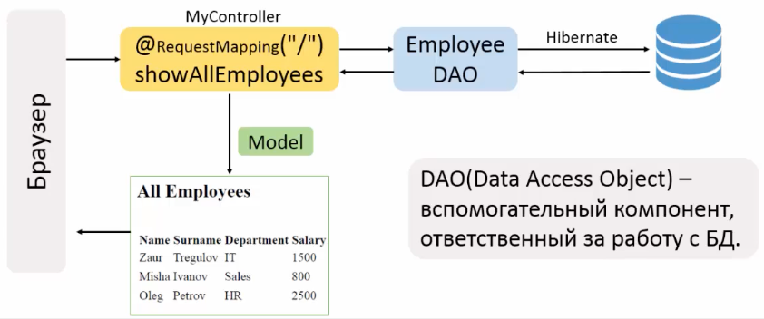
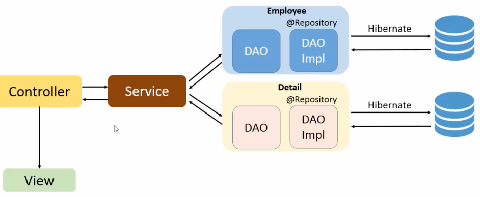

## Configuration
### Настройки БД
```sql
CREATE TABLE employees (
id serial PRIMARY KEY,
name varchar(15),
surname varchar(25),
department varchar(20),
salary int
);

INSERT INTO employees (name, surname, department, salary)
VALUES ('Zaur', 'Tregulov', 'IT', 500),
       ('Oleg', 'Ivanov', 'Sales', 700),
       ('Nina', 'Sidorova', 'HR', 800);
```
Создаем новый проект из maven-артефакта maven web app. В конфигурации добавляем Tomcat.
Добавляем зависимость Spring Web MVC.

### Настройки applicationContext.xml
Указываем пакет, где будет проходить сканирование компонентов:
```
<context:component-scan base-package="com.agrokhotov.spring.mvc_hibernate_aop" />
```
"Активируем" MVC-аннотации:
```
<mvc:annotation-driven/>
```

В файле applicationContext.xml описываем бины:
- transactionManager. Позволяет не открывать и закрывать транзакии вручную. В параметре **ref="sessionFactory"** задается ссылка на бин sessionFactory.
- резолвер вьюшек с путем, префиксом и суффиксом InternalResourceViewResolver
- пул соединений с параметрами соединения с базой данных
- sessionFactory для получения сессий для подключения к БД. Параметр **ref="dataSource"** такой же, как bean id у бина с пулом соединений.

@Transactonal - аннотация над методом, которая показывает, что метод должен выполняться как транзакция. Spring берет на себя открытие и закрытие транзакий. Для "активации" этой аннотации мы используем тэг
```
<tx:annotation-driven transaction-manager="transactionManager" />
```
## Работа с кодом
### Отображение списка всех работников
Для обращения к БД используем DAO, вспомогательный компонент, отвественный за работу с БД. DAO, это такой подход к проектированию, когда код для работы с БД выделен в отдельный класс. Обойтись без ДАО можно, но использование этого компонента является хорошей практикой.


Создаем сущность Employee, создаем интерфейс EmployeeDao и его имплементацию EmployeeDaoImpl. В имплементацию с помощью @Autowired внедряем зависимость sessionFactory, класс помечаем аннотацией @Repository. 

Создаем контроллер, помечаем его аннотацией @Controller. С помощью @Autowired внедряем зависимость EmployeeDAO (интерфейс).

@Repository, как и @Controller, это специализированный @Component. Аннотация @Repository используется для DAO. При поиске компонентов Spring будет регистрировать в спринг-контейнере все DAO с аннотацией @Repository. 

Создаем вью all-employees.jsp.
Запускаем проект - и воила!

### Аннотация @Service
Вводим новый компонент - сервис. В нем заключена бизнес-логика. Сервис определяет, надо ли в дальнейшем обращаться к ДАО и к какому именно. Сервис помечаем аннотацией @Service (она также является @Component).


Управление транзакциями будет осущетсвляться на уровне сервиса, поэтому @Transactonal используем в сервисах, а не в репозиториях.

### Добавление нового работника
Добавляем кнопку в форму.

Создаем новый метод в контроллере. Метод принимает модель, добавляет в ее аттрибуты новый объект Employee, возвращает имя вью employee-info:
```java
@RequestMapping("/addNewEmployee")
public String addNewEmployee(Model model) {
    Employee employee = new Employee();
    model.addAttribute("employee", employee);
    return "employee-info";
}
```
В EmployeeDAO (в имплементации) создаем метод, сохраняющий работника:
```java
public void saveEmployee(Employee employee) {
    Session session = sessionFactory.getCurrentSession();
    session.save(employee);
    }
```

Создаем в сервисе метод, сохраняющий работника в базе:
```java
public void saveEmployee(Employee employee);
```

Создаем вью employee-info. В _form:form action_ прописываем значение @RequestMapping метода, который будет сохранять нового работника (public String saveEmployee()).

Создаем в контроллере метод для сохранения работника, public String saveEmployee(). Метод должен сохранять работника, поэтому он принимает из формы объект Employee с уже заполненными данными.
```java
@RequestMapping("/saveEmployee")
public String saveEmployee(@ModelAttribute("employee") Employee employee) {
    employeeService.saveEmployee(employee);
    return "redirect:/";
}
```
